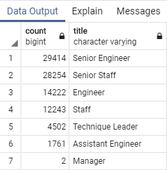
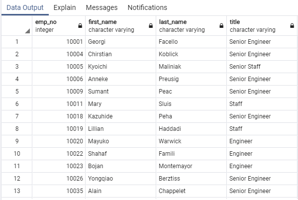
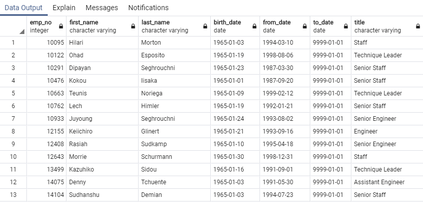
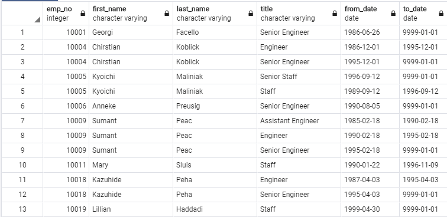

# Pewlett-Hackard-Analysis
Creating databases and importing the data using SQL

## Project Overview
This project will be using PgAdmin, and PostgreSQL to create a functional database that would assist Pewlett Hackard in analyzing their workforce, with special focus on their 'aging workforce'. This is particularly important at this time as this will allow for the company to properly assess and plan for the massive retirement of employees that will happen sometime in the near future. Ergo, this assignment consists of two technical deliverables. They are:

1. Identifying the Number of Retiring Employees by Title and,
2. Idefying the Employees Eligible for the Mentorship Program

Working with the `Employee_Database_challenge.sql`  starter code, `WHERE`, `INTO`, `INNER JOIN`, `ON ()`, `ORDER BY`, `COUNT`, and `DISTINCT ON ()` method will be used to find the requested results. The results will be printed to the command line and saved to two seperate folders (Data,and Queries). Screenshots of the output have also been captured to visualize the desired results.

## Purpose
The purpose of this project is to create a database that will assist the managers in identifying the number of roles that will need to filled for the upcoming "silver tsunami" program, as the company plans for the retirement of their aging workforce.

## Resources
- **Data Source:** Employee_Database_challenge.sql, schema.sql
- **URL:** https://app.quickdatabasediagrams.com/
- **Software:** PgAdmin, PostgreSQL
>
>
## **Retrieving Pewlett-Hackard Results**
>Using the ERD created in this module as a reference, a `Retirement Titles` table that holds all the titles of employees who were born between January 1, 1952 and December 31, 1955 was created afterwhich a table that contains the most recent title of each employee was created using the `DISTINCT ON` statement (some employees may have mutliple titles during their tenure due to promotions). Then, the` COUNT()` function was used to create a final table that has the number of retirement-age employees by most recent job title. Finally a mentorship-eligibility table was created that holds the current employees who were born between January 1, 1965 and December 31, 1965. Below is a summary of the results.  
>
>
### **The Number of Retiring Employees by Title**
>1. A total of `90,398` employess are approaching the retirement age for the company. This has the potential of putting  the company in peculiar position of they are not in a postion to fill these  when the opportune time arises.
>
>2. The majority of positions that will be needed to be filled (as expected) are the senior titles (senior engineer and staff) which accounts for 63.79%. 
>- 29,415 senior engineer: 32.54%
>- 28,254 senior staff: 31.26%
>- 14,221 engineer: 15.73%
>- 12,243 staff: 13.54%
>- 4,502 technique leader: 4.98%
>- 1,761 assistant engineer: 1.95%
>- 2 manager: 0.00%
>>**Table showing retiring titles from the terminal:**
>
>
>- The number of individuals being hired
>
>3. The number of individuals available for mentorship mentorship program are `1,549`.
>
>4. The number of individuals who are eligible for the mentorship program (`1,549`) compared to the total employees retiring (`90,398`), the company appears to have a huge gap to fill with an outstanding `88,849` positions/title to fill.
>
>**Table showing an output of eligible candidates for the mentorship programfrom the terminal:**
>
>
>
>
## Pewlett-Hackard Summary
>**How many roles will need to be filled as the "silver tsunami" begins to make an impact?**
>1. With over 30% of their workforce retiring, Pewlett-Hackard has a daunting but challenging task ahead as this means they will be task with filling `90,398` roles to fill in the near future. However with the mentorship program showing a prospect of `1,549` employees being qualified, and hopefull will assume positions of those retiring, will mean that Pewlett willhave an outstanding `88,849` titles/roles to fill.
>
>**Table showing an output of eligible candidates for the mentorship program:**
>
>
>
>**Are there enough qualified, retirement-ready employees in the departments to mentor the next generation of Pewlett Hackard employees?**
>1. With the total amount (`90,398`) of employees approaching retirement, Pewlett-Hackard is more than eqipped to to have the retirement-ready employees in the departments to mentor the next generration of Pewlett Hackard employees as only `1,549` are qualified. That means they have `58` times more retirement ready employees than there is qualied personnel.
>**Table showing an output of upcoming retirement titles from the terminal:**
>
>

**Two (2) additional queries or tables that may provide more insight into the upcoming "silver tsunami."?**
>1. One table that will be good to look at is the employees that are not currently qualified for the mentorship program, to see why they are not qualified and how best the company can help them to get there.
>2. Another table to assess is to view the titles of those who are qualified for the program, asthey will be promoted those roles will also need to be filled subsequently.

